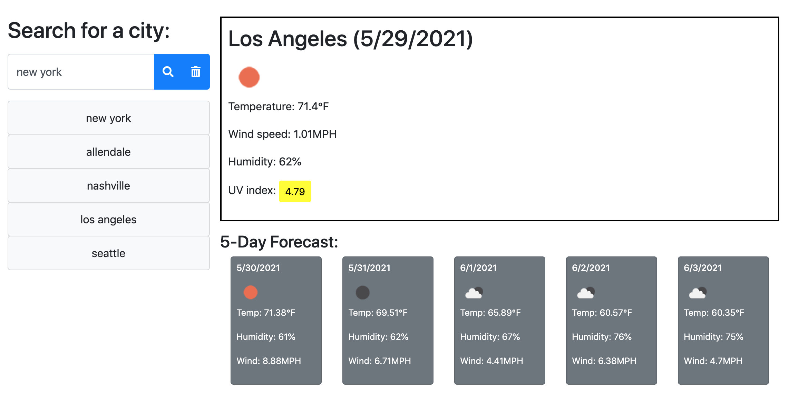
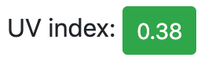
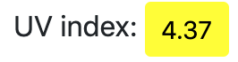

# Weather Dashboard

## For the user who would like to:
- check the current weather of the specific city
- check multiple cities' weather outlook to plan a trip to those cities

## How it works:
1. Search for a city
2. The city's current weather including its condition as an icon, the temperature, the humidity, the wind speed, and the UV index for that city appears on the card
3. UV Index tells the user if the conditions are favorable, moderate, or severe by **color**
4. 5-day forecast shows the user the date, the weather condition as an icon, the temperature, the humidity, and the wind spped on the separate cards
5. Click the city name from the search history list on the left to view the current and future weather conditions for that city
6. Click `Trash Icon` to delete the search history

## Features:
1. Re-search the city by clicking the city name from the search history list

```javascript
$("#history").on("click", "li", function() {
    $(".hide").removeAttr("hidden");
    getWeather($(this).text());
})
```
### Example:



2. UV index is color coded
### Example
- Favorable: Green

- Moderate: Yellow



3. When the user wants to clear the search history:
- the user can simply click the trash icon then refresh the page to delete the search history

### Example:
```javascript
$("#clear-button").on("click", function(){
    localStorage.clear();
})
```